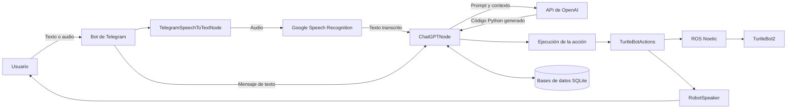

## Autor

**Jorge Suela Martín**

Proyecto académico de Ingeniería Informática — Universidad Rey Juan Carlos.

---

# TurtleBot ChatGPT Wrapper


Sistema de interacción humano-robot que permite controlar un **TurtleBot2 mediante lenguaje natural**.

El usuario envía mensajes de texto o audio a través de **Telegram**. Los mensajes de voz se transcriben automáticamente y se procesan mediante un modelo de lenguaje de OpenAI, que interpreta la intención del usuario y genera el código necesario para ejecutar la acción solicitada sobre el robot.

El proyecto ha sido desarrollado como **Trabajo Fin de Grado en Ingeniería Informática en la Universidad Rey Juan Carlos**.

<p align="center">
    
</p>

---

## Descripción general

El objetivo del proyecto es facilitar la interacción con un robot móvil mediante instrucciones expresadas de forma natural, evitando que el usuario necesite conocer comandos específicos de ROS o la estructura interna del sistema.

Algunos ejemplos de peticiones admitidas son:

```text
Avanza dos metros.
Gira a la derecha.
Llévame hasta la entrada.
¿Cuánto espacio tienes delante?
Recuerda este lugar como laboratorio.
Vuelve al lugar donde estabas antes.
Sígueme.
Deja de seguirme.
Empieza a seguir la pared.
Detente.
```

El sistema combina:

* Interacción mediante Telegram.
* Reconocimiento automático de voz.
* Interpretación de instrucciones mediante un modelo de lenguaje.
* Generación dinámica de código Python.
* Control del robot mediante ROS.
* Navegación autónoma con `move_base`.
* Almacenamiento persistente de lugares e interacciones.
* Síntesis de voz para comunicar respuestas al usuario.
* Modos autónomos de seguimiento de personas y paredes.

---

## Arquitectura del sistema



### Flujo de funcionamiento

1. El usuario envía un mensaje de texto o una nota de voz mediante Telegram.
2. Si el mensaje contiene audio, se transcribe utilizando Google Speech Recognition.
3. `ChatGPTNode` recopila la petición, el estado actual del robot, los lugares conocidos y el contexto de interacciones anteriores.
4. La información se envía al modelo de lenguaje.
5. El modelo genera código Python adaptado a las funciones disponibles en el sistema.
6. El código se valida y ejecuta en el entorno ROS.
7. El robot realiza la acción solicitada y comunica el resultado al usuario.
8. La interacción y la posición del robot se almacenan en una base de datos SQLite.

---

## Funcionalidades principales

### Control básico del robot

* Avance y retroceso.
* Rotación en ambos sentidos.
* Detención inmediata.
* Control de velocidad lineal y angular.
* Consulta de la posición y orientación actuales.

### Percepción del entorno

* Consulta de distancias a obstáculos.
* Procesamiento de la información de profundidad de la cámara RGB-D.
* Conversión de imágenes de profundidad al tópico `/scan`.
* Aproximación controlada al obstáculo más cercano.

### Navegación autónoma

* Navegación mediante `move_base`.
* Desplazamiento a coordenadas concretas.
* Navegación hacia lugares almacenados.
* Comprobación de llegada al destino.
* Cancelación de objetivos de navegación.
* Recuperación de la posición mediante AMCL.
* Uso de mapas previamente generados mediante SLAM.

### Memoria espacial

El robot puede guardar lugares relevantes junto con su posición y orientación:

```text
Recuerda este lugar como despacho.
Guarda esta posición como entrada.
Ve al laboratorio.
Elimina el lugar llamado almacén.
```

Los lugares se almacenan en bases de datos SQLite y pueden utilizarse en interacciones posteriores.

### Historial de interacciones

Después de cada petición se almacenan:

* La instrucción del usuario.
* Un resumen de la acción ejecutada.
* La posición del robot.
* La orientación del robot.
* La base de datos activa.

Este historial permite proporcionar al modelo un contexto limitado de las interacciones anteriores.

### Modo Follow Me

Permite que el TurtleBot siga a una persona utilizando la cámara RGB-D.

Mientras este modo está activo, el sistema bloquea otras acciones que impliquen movimiento para evitar conflictos entre controladores.

Ejemplos:

```text
Sígueme.
Empieza a seguirme.
Deja de seguirme.
Para de seguirme.
```

### Modo Wall Follower

Permite que el robot siga de forma autónoma una pared utilizando la información de profundidad disponible.

Al igual que en el modo Follow Me, no se permiten otras acciones de movimiento mientras el modo permanece activo.

Ejemplos:

```text
Empieza a seguir la pared.
Sigue la pared de la derecha.
Detén el seguimiento de pared.
```

### Interacción por voz

El robot puede reproducir mensajes mediante síntesis de voz para:

* Confirmar acciones.
* Comunicar errores.
* Indicar que ha llegado a un destino.
* Informar sobre lugares conocidos.
* Simular acciones no disponibles físicamente.
* Mantener conversaciones sencillas con el usuario.

---

## Componentes principales

| Componente                    | Descripción                                                                                                |
| ----------------------------- | ---------------------------------------------------------------------------------------------------------- |
| `ChatGPTNode.py`              | Nodo principal encargado de construir el prompt, comunicarse con OpenAI y ejecutar las acciones generadas. |
| `TelegramSpeechToTextNode.py` | Recibe mensajes de Telegram y transcribe las notas de voz.                                                 |
| `TurtleBotActions.py`         | Implementa las funciones disponibles para controlar y consultar el estado del robot.                       |
| `DatabaseHandler.py`          | Gestiona los lugares conocidos y el historial de interacciones mediante SQLite.                            |
| `RobotSpeaker.py`             | Gestiona la reproducción de respuestas mediante síntesis de voz.                                           |
| `WallFollower.py`             | Implementa el comportamiento autónomo de seguimiento de paredes.                                           |
| `launcher.sh`                 | Inicia los nodos y componentes necesarios para ejecutar el sistema.                                        |

---

## Tecnologías utilizadas

* **ROS Noetic**
* **Ubuntu 20.04**
* **Python 3.8**
* **TurtleBot2 Kobuki**
* **Cámara RGB-D Orbbec Astra**
* **OpenAI API**
* **Telegram Bot API**
* **Google Speech Recognition**
* **SQLite**
* **Gazebo**
* **RViz**
* **AMCL**
* **move_base**
* **gmapping**
* **depthimage_to_laserscan**

---

## Requisitos

### Hardware utilizado

La configuración principal del proyecto utiliza:

* TurtleBot2 con base Kobuki.
* Cámara RGB-D Orbbec Astra.
* Ordenador con Ubuntu 20.04.
* Dispositivo móvil con Telegram.
* Conexión de red entre los dispositivos.

El sistema no requiere un LIDAR físico. La información utilizada como escáner láser se obtiene a partir de la cámara de profundidad mediante `depthimage_to_laserscan`.

### Software

* Ubuntu 20.04.
* ROS Noetic.
* Python 3.8 o superior compatible con ROS Noetic.
* Espacio de trabajo Catkin.
* Paquetes de TurtleBot2 y Kobuki.
* Paquetes de navegación de ROS.
* Cuenta de OpenAI con acceso a la API.
* Bot de Telegram configurado.

---

## Instalación

### 1. Crear o utilizar un espacio de trabajo Catkin

```bash
mkdir -p ~/catkin_ws/src
cd ~/catkin_ws/src
```

### 2. Clonar el repositorio

```bash
git clone https://github.com/jorgesuela/TurtleBot_ChatGPT_Wrapper_TFG.git
```

### 3. Compilar el espacio de trabajo

```bash
cd ~/catkin_ws
catkin_make
```

### 4. Cargar el entorno de ROS

```bash
source /opt/ros/noetic/setup.bash
source ~/catkin_ws/devel/setup.bash
```

Para cargarlo automáticamente al abrir una terminal:

```bash
echo "source /opt/ros/noetic/setup.bash" >> ~/.bashrc
echo "source ~/catkin_ws/devel/setup.bash" >> ~/.bashrc
source ~/.bashrc
```

### 5. Conceder permisos de ejecución

```bash
cd ~/catkin_ws/src/TurtleBot_ChatGPT_Wrapper_TFG
chmod +x launcher.sh
find . -name "*.py" -exec chmod +x {} \;
```

---

## Dependencias de Python

Las dependencias concretas pueden variar según la versión del proyecto. Entre las principales se encuentran:

```bash
pip3 install openai
pip3 install SpeechRecognition
pip3 install python-telegram-bot
```

También deben estar instaladas las dependencias de ROS utilizadas por TurtleBot2, navegación, transformaciones y procesamiento de la cámara RGB-D.

Cuando el repositorio incluya un archivo `requirements.txt`, las dependencias podrán instalarse mediante:

```bash
pip3 install -r requirements.txt
```

---

## Configuración

### Clave de OpenAI

La clave de la API nunca debe almacenarse directamente en el repositorio.

Debe definirse mediante una variable de entorno:

```bash
export OPENAI_API_KEY="TU_CLAVE_DE_OPENAI"
```

Para hacer permanente la configuración:

```bash
echo 'export OPENAI_API_KEY="TU_CLAVE_DE_OPENAI"' >> ~/.bashrc
source ~/.bashrc
```

### Token del bot de Telegram

El bot debe crearse mediante `@BotFather` en Telegram.

Se recomienda almacenar el token como variable de entorno:

```bash
export TELEGRAM_BOT_TOKEN="TOKEN_DEL_BOT"
```

No se deben publicar tokens, claves de API, direcciones privadas ni credenciales dentro del repositorio.

### Dirección IP del robot

Cuando los nodos se ejecuten en equipos diferentes, se deben revisar:

* La dirección IP del robot.
* La dirección IP del ordenador principal.
* Las variables `ROS_MASTER_URI` y `ROS_IP`.
* La constante o parámetro `ROBOT_IP` utilizado para establecer conexiones remotas.
* La conectividad entre ambos dispositivos.

Ejemplo:

```bash
export ROS_MASTER_URI=http://IP_DEL_MASTER:11311
export ROS_IP=IP_DEL_DISPOSITIVO
```

### Bases de datos

El proyecto utiliza varias bases de datos SQLite para almacenar lugares e interacciones.

Antes de ejecutar el sistema, se deben comprobar las rutas configuradas en `ChatGPTNode.py` y `DatabaseHandler.py`.

Ejemplo de estructura:

```text
database/
├── turtlebot_database_1.db
├── turtlebot_database_2.db
└── turtlebot_database_3.db
```

### Mapa de navegación

Para utilizar la navegación autónoma se debe configurar un mapa compatible con `map_server` y AMCL.

Habitualmente se necesitan los siguientes archivos:

```text
maps/
├── mapa.pgm
└── mapa.yaml
```

También deben revisarse:

* La resolución del mapa.
* El origen.
* El frame global utilizado.
* Las configuraciones de AMCL.
* Los parámetros del planificador local y global.

---

## Ejecución

Una vez configurado el entorno, el sistema puede iniciarse mediante:

```bash
cd ~/catkin_ws/src/TurtleBot_ChatGPT_Wrapper_TFG
./launcher.sh
```

Dependiendo del entorno, puede ser necesario iniciar previamente:

* `roscore`.
* La base Kobuki.
* La cámara RGB-D.
* `depthimage_to_laserscan`.
* El servidor del mapa.
* AMCL.
* `move_base`.
* El nodo Follow Me.
* Los nodos auxiliares del sistema.

Para comprobar los nodos activos:

```bash
rosnode list
```

Para consultar los tópicos disponibles:

```bash
rostopic list
```

---

## Tópicos principales

Entre los tópicos utilizados por el sistema se encuentran:

| Tópico                    | Función                                                    |
| ------------------------- | ---------------------------------------------------------- |
| `/scan`                   | Distancias obtenidas a partir de la cámara de profundidad. |
| `/odom`                   | Odometría del robot.                                       |
| `/amcl_pose`              | Posición estimada dentro del mapa.                         |
| `/map`                    | Mapa de ocupación del entorno.                             |
| `/cmd_vel_mux/input/navi` | Comandos de velocidad enviados a la base.                  |
| `/follower_state`         | Estado del modo Follow Me.                                 |
| `/wall_follower_state`    | Estado del modo Wall Follower.                             |

Los nombres pueden variar según los launch files y la configuración de ROS utilizada.

---

## Gestión de los modos autónomos

Para evitar conflictos entre comportamientos, el sistema aplica las siguientes reglas:

1. Solo puede existir un modo autónomo de movimiento activo al mismo tiempo.
2. Mientras Follow Me esté activo, no se ejecutarán otras acciones de movimiento.
3. Mientras Wall Follower esté activo, no se ejecutarán otras acciones de movimiento.
4. Una orden de parada siempre tiene prioridad.
5. Antes de iniciar otro desplazamiento, debe detenerse el modo autónomo activo.

Estas restricciones se incluyen en el contexto proporcionado al modelo de lenguaje y también deben comprobarse en los nodos responsables del movimiento.

---

## Consideraciones de seguridad

Este proyecto utiliza generación dinámica de código mediante un modelo de lenguaje.

Por este motivo:

* Debe ejecutarse únicamente en entornos controlados.
* No debe utilizarse en aplicaciones críticas.
* El código generado debe limitarse a las funciones autorizadas.
* Las credenciales nunca deben incluirse en el prompt ni en el repositorio.
* El robot debe disponer de mecanismos de parada accesibles.
* Las primeras pruebas deben realizarse con velocidades reducidas.
* Se recomienda supervisar físicamente al robot durante la ejecución.
* No debe utilizarse cerca de escaleras, personas vulnerables u obstáculos peligrosos.

Este repositorio tiene una finalidad académica y experimental.

---

## Limitaciones actuales

* El robot no dispone de reconocimiento visual semántico de objetos.
* No puede identificar directamente elementos como extintores, puertas o mobiliario mediante visión.
* Las referencias a objetos y lugares dependen de información previamente almacenada.
* La percepción del entorno se basa en una única cámara RGB-D.
* El campo de visión utilizado como escáner es más limitado que el de un LIDAR convencional.
* La respuesta depende de la conexión a Internet y de la disponibilidad de la API.
* La generación y ejecución del código introduce cierta latencia.
* El contexto conversacional almacenado es limitado.
* Los comportamientos autónomos pueden verse afectados por paredes, obstáculos o entornos poco estructurados.
* El proyecto está desarrollado sobre ROS1 Noetic y no ha sido migrado a ROS2.

---

## Posibles mejoras futuras

* Migración de ROS1 a ROS2.
* Incorporación de un LIDAR.
* Reconocimiento y localización semántica de objetos.
* Uso de modelos de lenguaje ejecutados localmente.
* Reducción de la latencia de generación y ejecución.
* Sustitución de la generación de nodos completos por acciones estructuradas.
* Validación avanzada del código generado.
* Ejecución aislada mediante sandbox.
* Mejora del seguimiento de personas.
* Mejora del comportamiento Wall Follower.
* Ampliación de la memoria conversacional.
* Gestión automática de mapas y lugares.
* Interfaz gráfica de supervisión.
* Soporte para nuevos robots y sensores.

---

## Contexto académico

Este proyecto ha sido desarrollado como Trabajo Fin de Grado del Grado en Ingeniería Informática de la **Universidad Rey Juan Carlos**.

Su objetivo es estudiar la integración de modelos de lenguaje en sistemas robóticos y evaluar la interacción humano-robot mediante instrucciones expresadas en lenguaje natural.

---

## Autor

**Jorge Suela Martín**

Proyecto académico de Ingeniería Informática — Universidad Rey Juan Carlos.

---

## Aviso

El software se proporciona con fines educativos y de investigación. El autor no se responsabiliza de daños derivados del uso del robot, de errores en el código generado o de la ejecución del sistema en entornos no supervisados.
